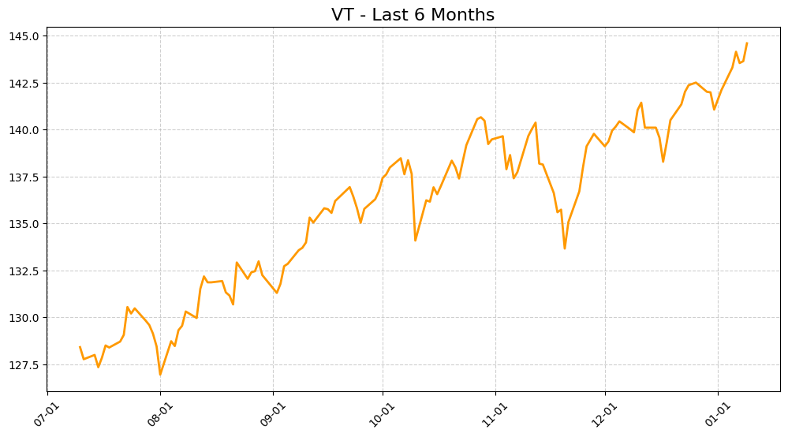

# ETF Price Tracker

[](https://www.python.org/downloads/)
[](https://aws.amazon.com/serverless/sam/)
[](https://aws.amazon.com/eventbridge/)
[](https://aws.amazon.com/lambda/)

<table>
    <thead>
        <tr>
           <th style="text-align:center"><a href="#日本語版">日本語版</a></th>
           <th style="text-align:center"><a href="#english-version">English Version</a></th>     
        </tr>
    </thead>
</table>

---

## 日本語版

### 概要

VT、VOO、QQQの人気ETFの価格とUSD/JPY為替レートを監視し、日々の価格変動をテキストでLINEに通知します。  
さらに、VTの3ヶ月株価チャートを画像で送信する機能も備えています。

### アーキテクチャ

```

EventBridge スケジュール
↓
AWS Lambda
├─ yfinance（データ取得）
├─ matplotlib（チャート生成: /tmp/vt_chart.png）
├─ boto3（S3アップロード）
├─ S3 presigned URL生成
└─ LINE Messaging API（Push API）
├─ テキスト通知送信
└─ 画像通知送信（HTTPS URL）

```

### 処理フロー

1. **EventBridge スケジュール起動**  
   毎日火〜土曜日の午前9時（JST）にLambda関数を実行

2. **データ取得**  
   yfinanceを使用してETF価格とUSD/JPY為替レートを取得

3. **チャート生成**  
   matplotlibでVTの3ヶ月チャートを生成し、`/tmp/vt_chart.png`に保存

4. **S3アップロード**  
   boto3を使用してチャート画像をS3にアップロード

5. **Presigned URL生成**  
   S3から有効期限付きのpresigned URL（GET）を取得

6. **LINE Push API送信**  
   テキストと画像でETF価格とチャートを送信

### 使用技術

- AWS Lambda
- Python 3.13
- AWS EventBridge
- AWS S3
- AWS SAM
- yfinance
- matplotlib
- LINE Messaging API

### 監視対象ETF

| シンボル | 正式名称 | 説明 |
|----------|----------|------|
| VT | バンガード・トータルワールドストック | 世界株式市場全体を対象としたETF |
| VOO | バンガード・S&P500 | S&P500指数 |
| QQQ | インベスコQQQトラスト | NASDAQ100指数 |

### LINE 通知メッセージの例

#### テキスト通知

例1:
```

📈ETF Price Tracker 2025-04-03

【VT】
現在値: $100.20
前日比: -3.8%
前週比: -9.2%

【VOO】
現在値: $390.50
前日比: -3.1%
前週比: -10.0%

【QQQ】
現在値: $352.10
前日比: -5.97%
前週比: -8.5%

【為替】
USD/JPY: 150.25

```

例2:
```

📈ETF Price Tracker 2020-03-16

【VT】
現在値: $61.30
前日比: -12.0%
前週比: -17.4%

【VOO】
現在値: $220.00
前日比: -11.3%
前週比: -16.2%

【QQQ】
現在値: $170.40
前日比: -11.7%
前週比: -15.3%

````

#### 画像通知

VTの3ヶ月株価チャートが画像として送信されます。



### 環境構築手順

#### Python仮想環境の作成

```bash
python -m venv .venv
source .venv/bin/activate
````

#### 依存関係のインストール

```bash
pip install -r requirements.txt
```

#### 開発用依存関係のインストール

```bash
pip install -r requirements-dev.txt
```

### ローカル開発

#### ローカル実行

`.env` に `LINE_CHANNEL_ACCESS_TOKEN` と `LINE_USER_ID` を設定しておくと、ローカル実行時に自動で読み込みます。

#### 静的解析・フォーマット・型チェック

```bash
ruff check src --fix
ruff format src
mypy src
```

#### テスト実行

```bash
python -c "from src.handler import lambda_handler; from aws_lambda_powertools.utilities.typing import LambdaContext; print(lambda_handler({}, LambdaContext()))"
```

```bash
python -m pytest tests/
```

### CI/CD

GitHub Actions と AWS SAM を使用したサーバーレスアプリケーションの自動デプロイメントを実装しています。

---

## English Version

### Overview

This application monitors the prices of popular ETFs (VT, VOO, QQQ) and the USD/JPY exchange rate, and sends daily price change notifications to LINE in text format.
It also includes a feature to send a 3-month price chart for VT as an image.

### Architecture

```
EventBridge Schedule
↓
AWS Lambda
├─ yfinance (Data Retrieval)
├─ matplotlib (Chart Generation: /tmp/vt_chart.png)
├─ boto3 (S3 Upload)
├─ S3 Presigned URL Generation
└─ LINE Messaging API (Push API)
├─ Send Text Notification
└─ Send Image Notification (HTTPS URL)
```

### Processing Flow

1. **EventBridge Schedule Trigger**
   Executes the Lambda function every day from Tuesday to Saturday at 9:00 AM (JST).

2. **Data Retrieval**
   Retrieves ETF prices and the USD/JPY exchange rate using yfinance.

3. **Chart Generation**
   Generates a 3-month price chart for VT using matplotlib and saves it to `/tmp/vt_chart.png`.

4. **S3 Upload**
   Uploads the chart image to Amazon S3 using boto3.

5. **Presigned URL Generation**
   Generates a presigned URL (GET) with an expiration time.

6. **LINE Push API Notification**
   Sends ETF price information and the chart via text and image messages using the LINE Messaging API.

### Technologies Used

* AWS Lambda
* Python 3.13
* AWS EventBridge
* AWS S3
* AWS SAM
* yfinance
* matplotlib
* LINE Messaging API

### Monitored ETFs

| Symbol | Official Name                  | Description                                  |
| ------ | ------------------------------ | -------------------------------------------- |
| VT     | Vanguard Total World Stock ETF | ETF covering the entire global equity market |
| VOO    | Vanguard S&P 500 ETF           | S&P 500 Index                                |
| QQQ    | Invesco QQQ Trust              | NASDAQ-100 Index                             |

### Example LINE Notification Messages

#### Text Notification

Example 1:

```
📈ETF Price Tracker 2025-04-03

【VT】
Current Price: $100.20
Day-over-Day Change: -3.8%
Week-over-Week Change: -9.2%

【VOO】
Current Price: $390.50
Day-over-Day Change: -3.1%
Week-over-Week Change: -10.0%

【QQQ】
Current Price: $352.10
Day-over-Day Change: -5.97%
Week-over-Week Change: -8.5%

【FX】
USD/JPY: 150.25
```

Example 2:

```
📈ETF Price Tracker 2020-03-16

【VT】
Current Price: $61.30
Day-over-Day Change: -12.0%
Week-over-Week Change: -17.4%

【VOO】
Current Price: $220.00
Day-over-Day Change: -11.3%
Week-over-Week Change: -16.2%

【QQQ】
Current Price: $170.40
Day-over-Day Change: -11.7%
Week-over-Week Change: -15.3%
```

#### Image Notification

A 3-month price chart for VT is sent as an image.


### Environment Setup

#### Create Python Virtual Environment

```bash
python -m venv .venv
source .venv/bin/activate
```

#### Install Dependencies

```bash
pip install -r requirements.txt
```

#### Install Development Dependencies

```bash
pip install -r requirements-dev.txt
```

### Local Development

#### Local Execution

If `LINE_CHANNEL_ACCESS_TOKEN` and `LINE_USER_ID` are set in `.env`, they will be loaded automatically during local execution.

#### Static Analysis and Formatting

```bash
ruff check src --fix
ruff format src
mypy src
```

#### Run Tests

```bash
python -c "from src.handler import lambda_handler; from aws_lambda_powertools.utilities.typing import LambdaContext; print(lambda_handler({}, LambdaContext()))"
```

```bash
python -m pytest tests/
```

### CI/CD

Automated deployment of the serverless application using GitHub Actions and AWS SAM.
